```python
import sys
sys.version
```


    '3.6.2 | packaged by conda-forge | (default, Jul 23 2017, 22:59:30) \n[GCC 4.8.2 20140120 (Red Hat 4.8.2-15)]'


```python
import matplotlib.pyplot as plt
from seaborn import palplot # only used to show off palettes 

from string import ascii_uppercase
import numpy as np


def example_scatter_plot(num_cats=6):
    for i in range(num_cats):
        cat = ascii_uppercase[i]
        x = np.random.random(100)
        y = np.random.random(100) + i
        plt.scatter(x, y, marker='o', label=cat)
    plt.legend(loc='best')


def example_bar_plot(num_cats=6):
    bar_width = 1 / num_cats + 1
    for i in range(num_cats):
        cat = ascii_uppercase[i]
        x = np.arange(11) + 5 * i
        y = np.array([0, 1, 2, 3, 4, 5, 4, 3, 2, 1, 0]) + np.random.random(1)
        plt.bar(x, y, label=cat, width=bar_width)
    plt.legend(loc='best')


def example_plots(num_cats=6):
    example_scatter_plot(num_cats)
    plt.show()
    example_bar_plot(num_cats)
    plt.show()
```

## Default Maplotlib Theme


```python
example_plots()
```


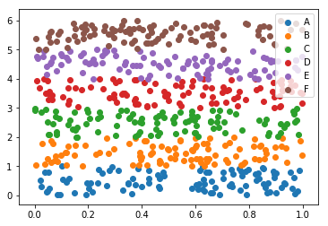


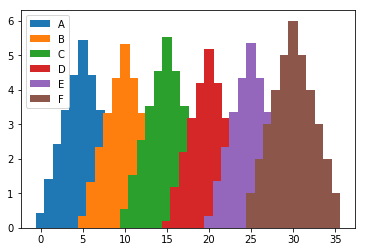


As you can see, the default theme has good contrast in colors, but leaves a bit to be desired in the sige of the chart (i.e. figure size aka figsize) and font. 

## Usage


```python
import pyplot_themes as themes
themes.__version__
```


    '0.1.0'


```python
themes.theme_minimal()
```

This updates the global theme settings for matplotlib with a nice minimal style using colorblind safe colors.


```python
palplot(themes.palettes.Colorblind.colors)
```


```python
example_plots()
```


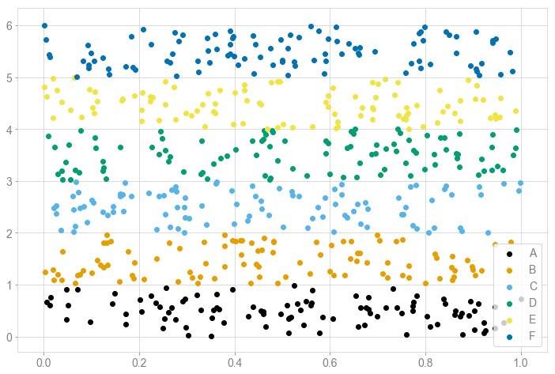


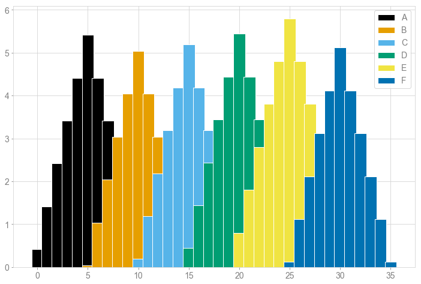


As you can see, our plots are much larger now, have accessible colors, and have some light gridlines to make identifying values a bit easier.

There are a few parameters available in all themes:
- grid: toggles grid lines on/off
- ticks: toggles tick marks on/off
- figsize: sets the default size of plots (you can still change each plot in an ad hoc manner if needed)
- fontsize: sets the default font size to be used

Some themes will allow you to pass in whatever colors you want, others you have to pick a color scheme from available options, some only let you reverse the order of the default color palette, and some don't let you mess with the colors at all. Experiment and find out what you like.


```python
themes.theme_minimal(grid=False, ticks=False, fontsize=18)
example_scatter_plot()
plt.title("Look Mom, no lines!")
```


    Text(0.5,1,'Look Mom, no lines!')


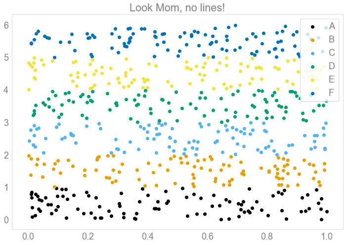


### Themes


```python
themes.theme_dark()
example_plots()
```


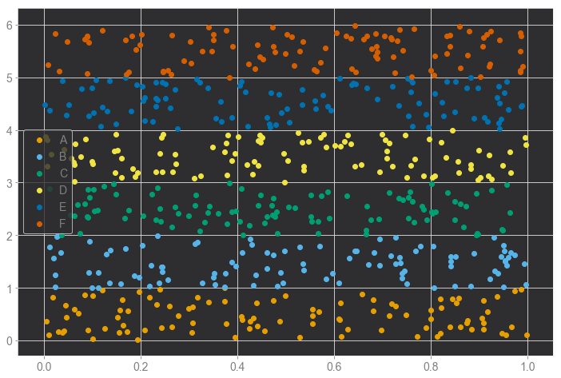


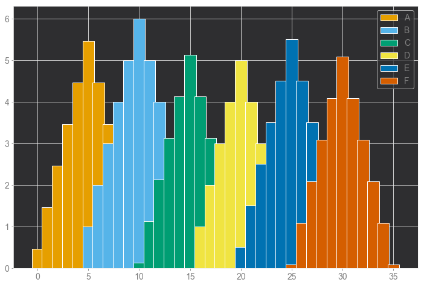


```python
themes.theme_tableau()
example_plots()
```


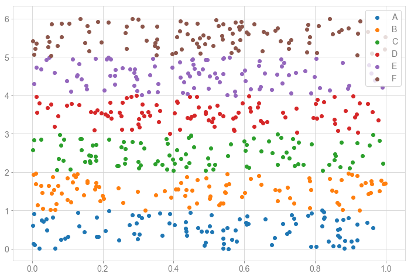


```python
palplot(themes.palettes.Solarized.dark)
```


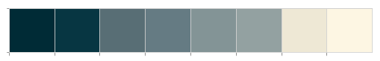


```python
themes.theme_solarized(scheme="dark")
example_plots()
```


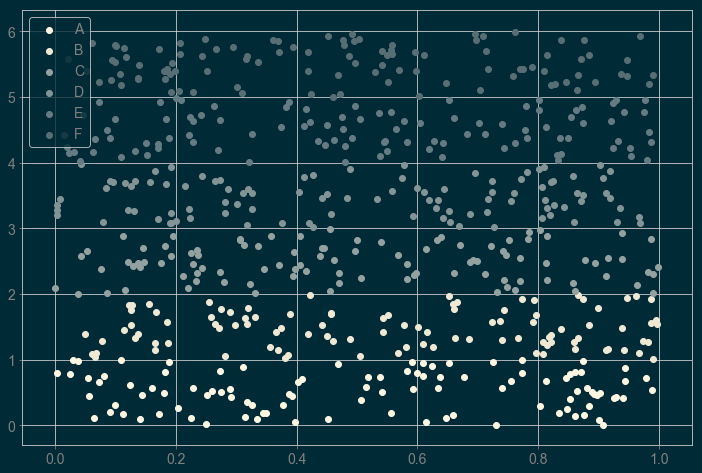


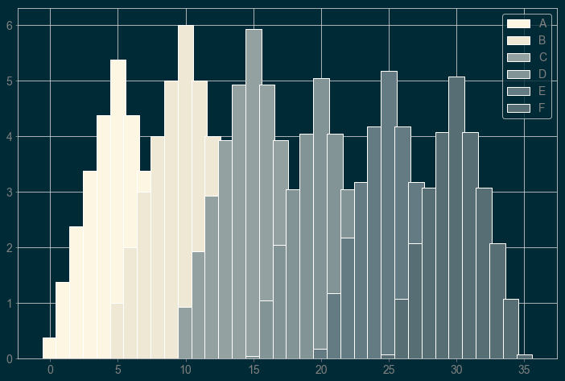


```python
palplot(themes.palettes.Solarized.light)
```


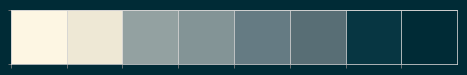


```python
themes.theme_solarized(scheme="light")
example_plots()
```


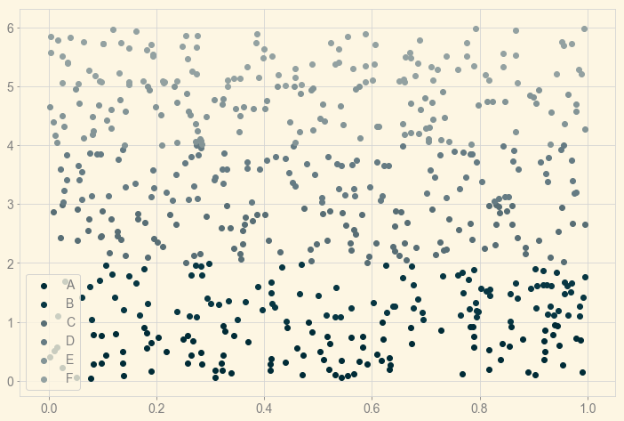


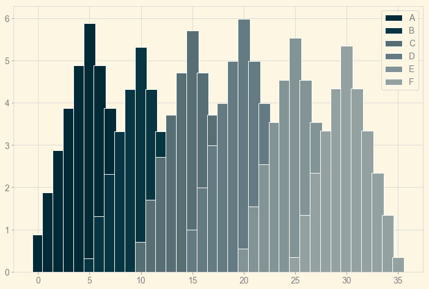


```python
palplot(themes.palettes.PaulTolColorSchemes.colors)
```


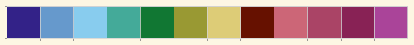


```python
themes.theme_paul_tol()
example_plots(12)
```


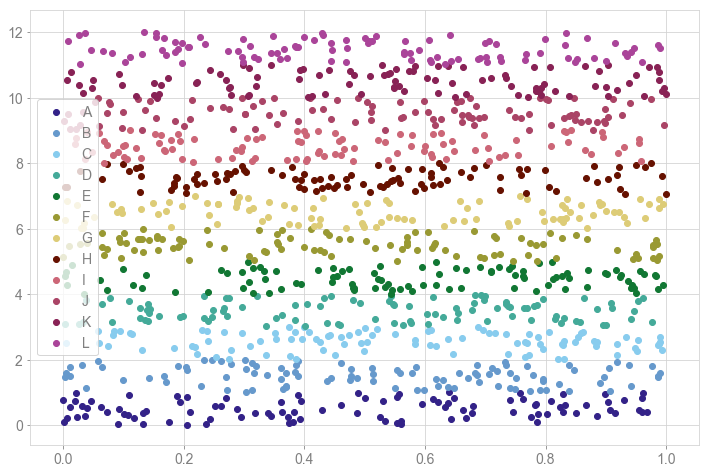


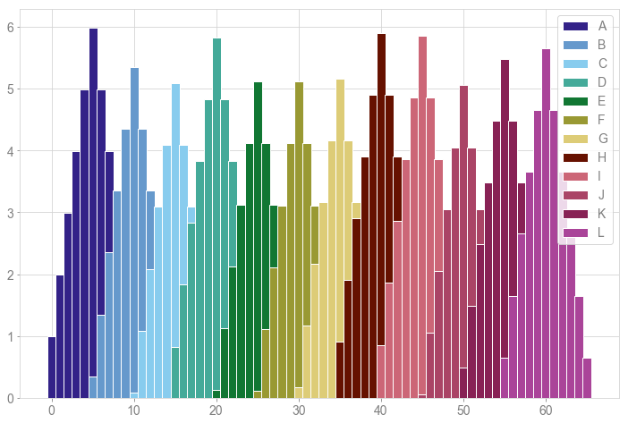


```python
themes.theme_paul_tol(reverse_colors=True, grid=False)
example_plots(num_cats=12)
```


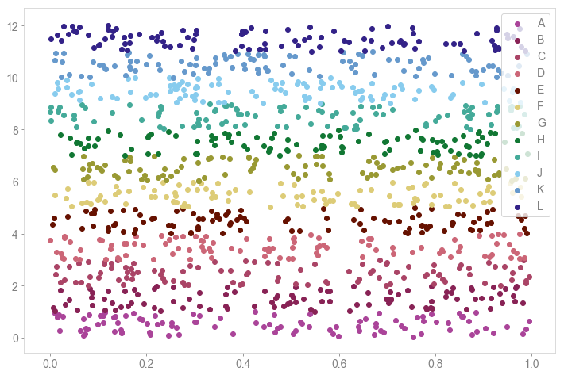


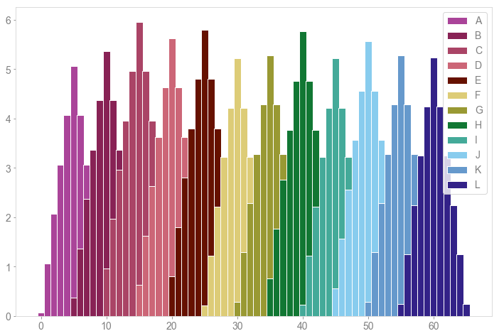


```python
palplot(themes.palettes.Few.light)
palplot(themes.palettes.Few.medium)
palplot(themes.palettes.Few.dark)
```


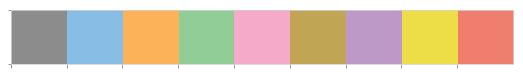


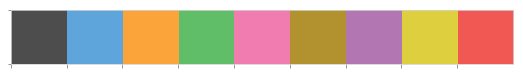


```python
themes.theme_few(scheme="light")
example_plots()
```


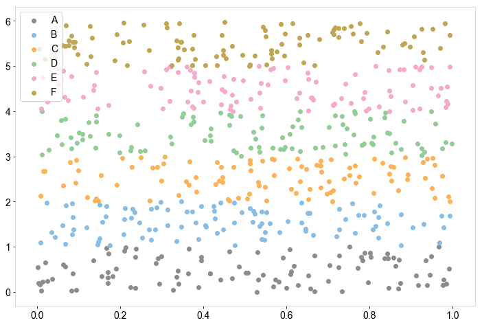


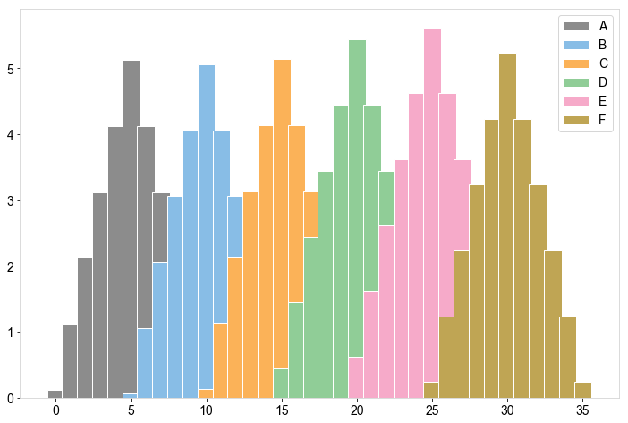


```python
themes.theme_few(scheme="medium", figsize=[5, 5])
example_scatter_plot()
```


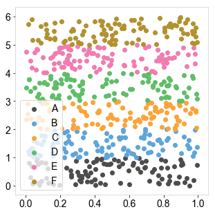


```python
themes.theme_few(scheme="dark")
example_bar_plot()
```


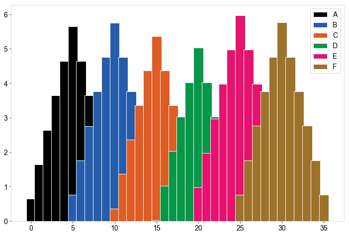


```python
themes.theme_ucberkeley(figsize=[10, 5])
example_plots(num_cats=4)
```


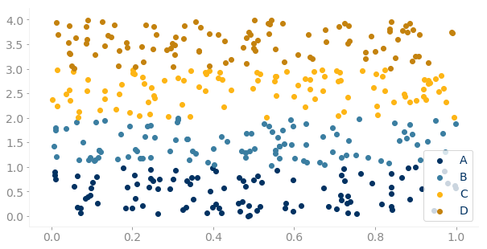


```python
themes.theme_ucberkeley(scheme="all", figsize=[12, 6])
example_plots(num_cats=16)
```


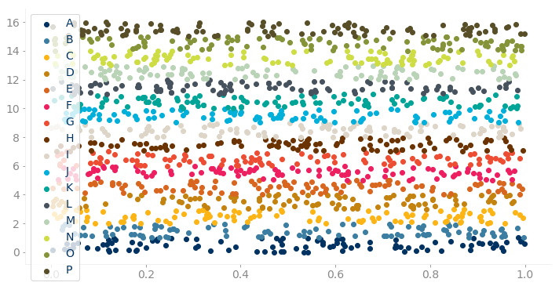


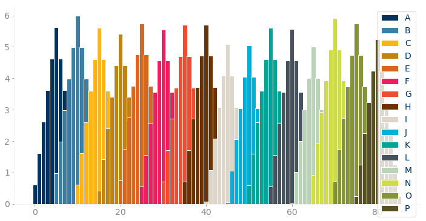


### Themes that come with matplotlib

These next themes actually come with matplotlib and you can use them without the `pyplot-themes` package.
The functions here are basically thin wrappers for calling the matplotlib defined styles, but use a bigger figsize by default.


```python
themes.theme_fivethirtyeight()
example_plots()
```


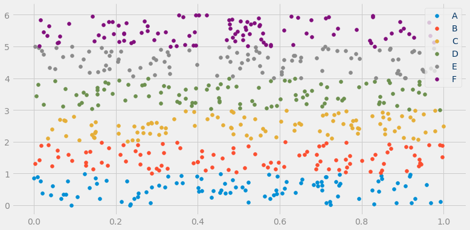


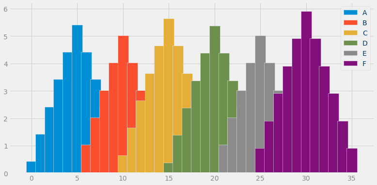


```python
themes.theme_ggplot2(figsize=[10, 5])
example_plots()
```


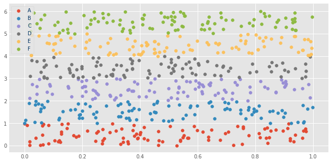


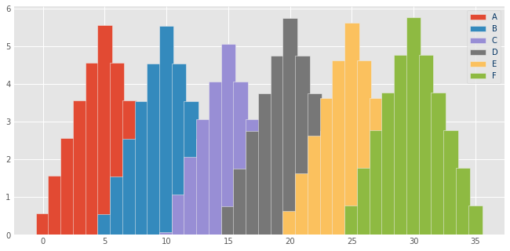


`bmh` stands for Bayesian Methods for Hackers


```python
themes.theme_bmh()
example_scatter_plot()
```


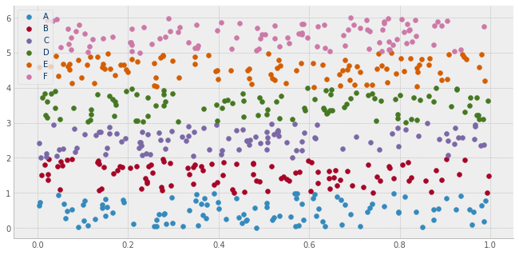


So we also have an alias for the spelled out version to make it easier to discover


```python
themes.theme_bayesian_methods_for_hackers()
example_bar_plot()
```


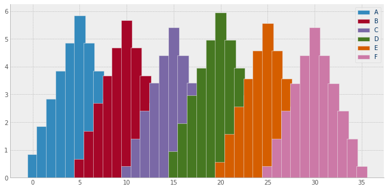


While this package provides light and dark solarized themes, `matplotlib` comes with a light version as well. This one is a good choice if you want to keep more contrast in the colors of your plots.


```python
themes.theme_solarized_light2()
example_plots()
```


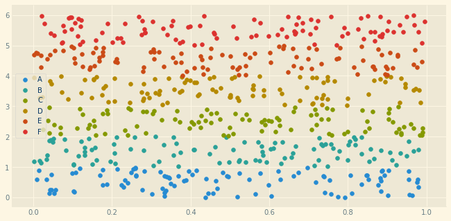


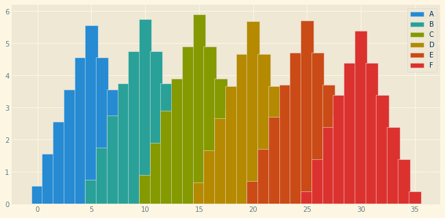


In addition to making it easy to find and call the matplotlib themes, `pyplot-themes` also makes it easier to modify them slightly. For example say you want to use the `ggplot2` theme, but you want to use the Paul Tol Color Schemes palette with it.


```python
themes.theme_ggplot2(palette=themes.palettes.PaulTolColorSchemes.colors, figsize=[12, 6])
example_bar_plot(num_cats=12)
```


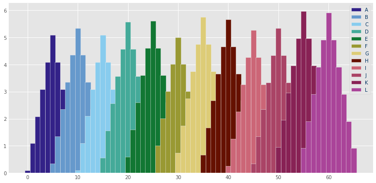


Or maybe the `fivethirtyeight` colors


```python
themes.theme_ggplot2(palette=themes.palettes.FiveThirtyEight.colors)
example_bar_plot()
```


### Resetting to back to matplotlib defaults

Of course, sometimes when you are trying out different themes, you may find you modified a setting that you didn't quite like, but aren't sure what changed. To aid in debugging, we created a function to reset the theme back to what matplotlib starts with. Of course, you may just like the matplotlib defaults and that's ok.

Note: The default settings for matplotlib can be slightly different depending on if you are using in python files (e.g. scripts) vs. in jupyter notebooks using `%matplotlib inline`. The reset function assumes you are using a notebook by default, but provides a parameter to toggle that off if you are not:

```python
themes.theme_reset(notebook=False)
```


```python
themes.theme_reset()  # could also use the alias `themes.theme_matplotlib_default()`
example_bar_plot()
```


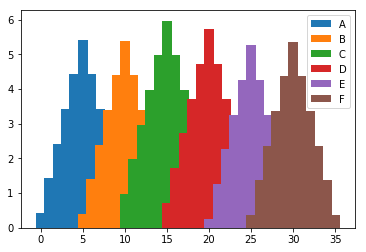


### Palettes

In addition to the themes above, there are a bunch of color palettes provided. Here are a few to show off.


```python
palplot(themes.palettes.Autumn1.colors)
```


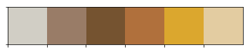


```python
palplot(themes.palettes.Autumn2.colors)
```


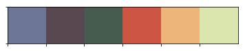


```python
palplot(themes.palettes.Canyon.colors)
```


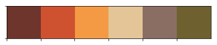


```python
palplot(themes.palettes.Chili.colors)
```


```python
palplot(themes.palettes.Tomato.colors)
```


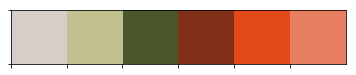


```python
palplot(themes.palettes.Few.medium)
```


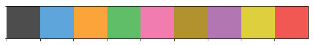


```python
palplot(themes.palettes.FiveThirtyEight.colors)
```


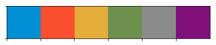


```python
palplot(themes.palettes.Solarized.light)
palplot(themes.palettes.Solarized.dark)
```


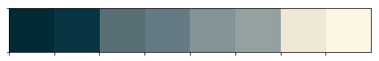


```python
palplot(themes.palettes.UCBerkeley.primary_colors)
palplot(themes.palettes.UCBerkeley.secondary_colors)
```


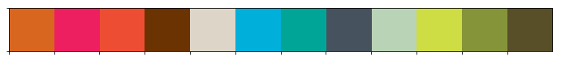


### Using with Pandas


```python
import pandas as pd
```


```python
# some made up date
sales = np.random.randint(low=10, high=20, size=30) * [i**2 for i in range(1, 31)]
revenue = np.random.random(30) * sales
months = pd.date_range(start="2010-01-01", periods=30, freq="M")

df = pd.DataFrame({"sales": sales, "revenue": revenue.round(2)}, index=months)
```


```python
df.head()
```


<div>
<style scoped>
    .dataframe tbody tr th:only-of-type {
        vertical-align: middle;
    }

    .dataframe tbody tr th {
        vertical-align: top;
    }

    .dataframe thead th {
        text-align: right;
    }
</style>
<table border="1" class="dataframe">
  <thead>
    <tr style="text-align: right;">
      <th></th>
      <th>sales</th>
      <th>revenue</th>
    </tr>
  </thead>
  <tbody>
    <tr>
      <th>2010-01-31</th>
      <td>11</td>
      <td>7.82</td>
    </tr>
    <tr>
      <th>2010-02-28</th>
      <td>60</td>
      <td>21.01</td>
    </tr>
    <tr>
      <th>2010-03-31</th>
      <td>135</td>
      <td>49.44</td>
    </tr>
    <tr>
      <th>2010-04-30</th>
      <td>240</td>
      <td>182.76</td>
    </tr>
    <tr>
      <th>2010-05-31</th>
      <td>375</td>
      <td>363.26</td>
    </tr>
  </tbody>
</table>
</div>


```python
themes.theme_minimal()
df.plot()
```


    <matplotlib.axes._subplots.AxesSubplot at 0x7f9819122f28>


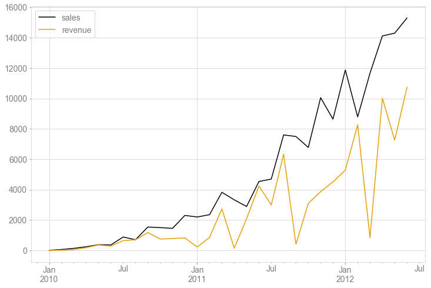


```python
themes.theme_dark(palette=themes.palettes.Solarized.light)
df.plot()
```


    <matplotlib.axes._subplots.AxesSubplot at 0x7f981912e7f0>


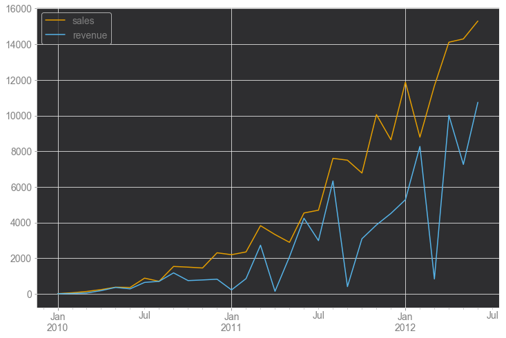

